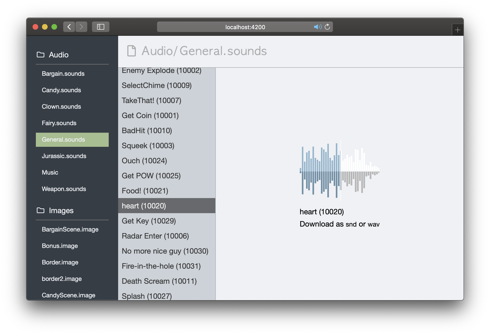
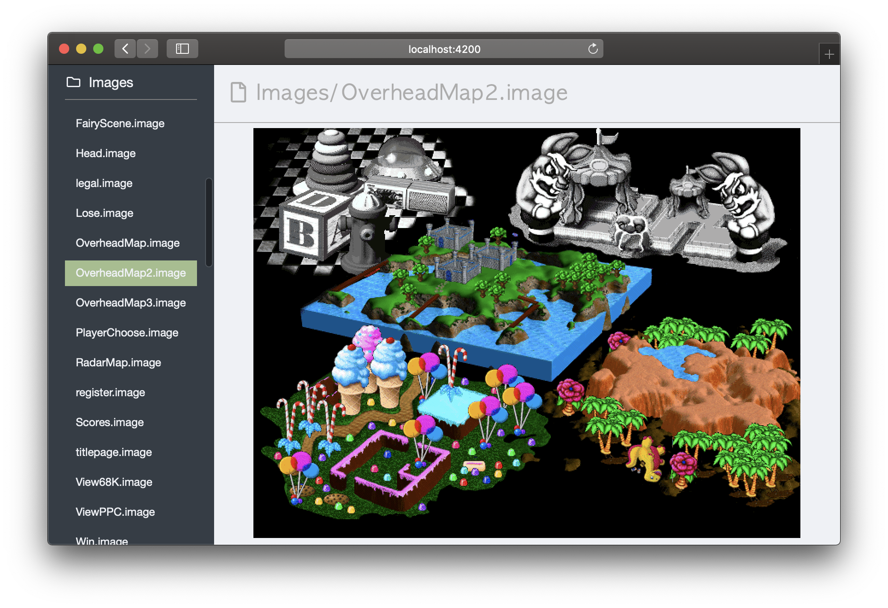
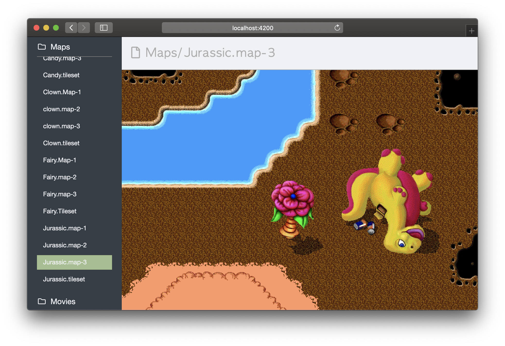
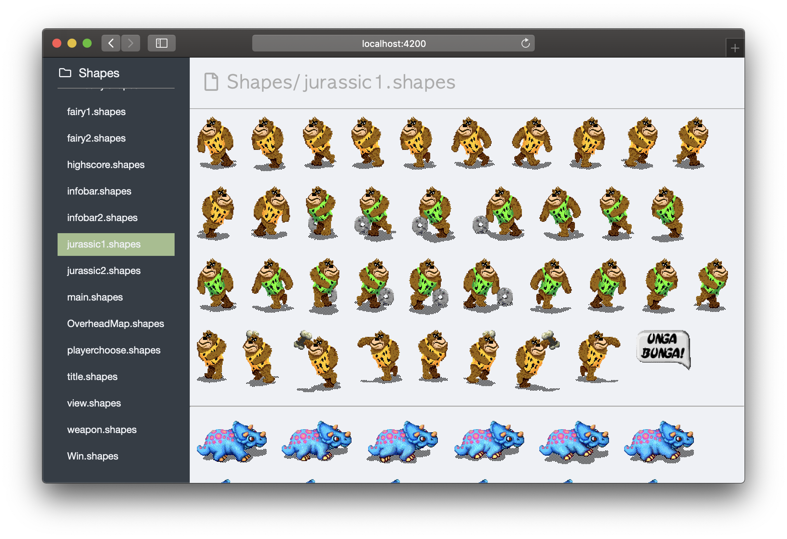
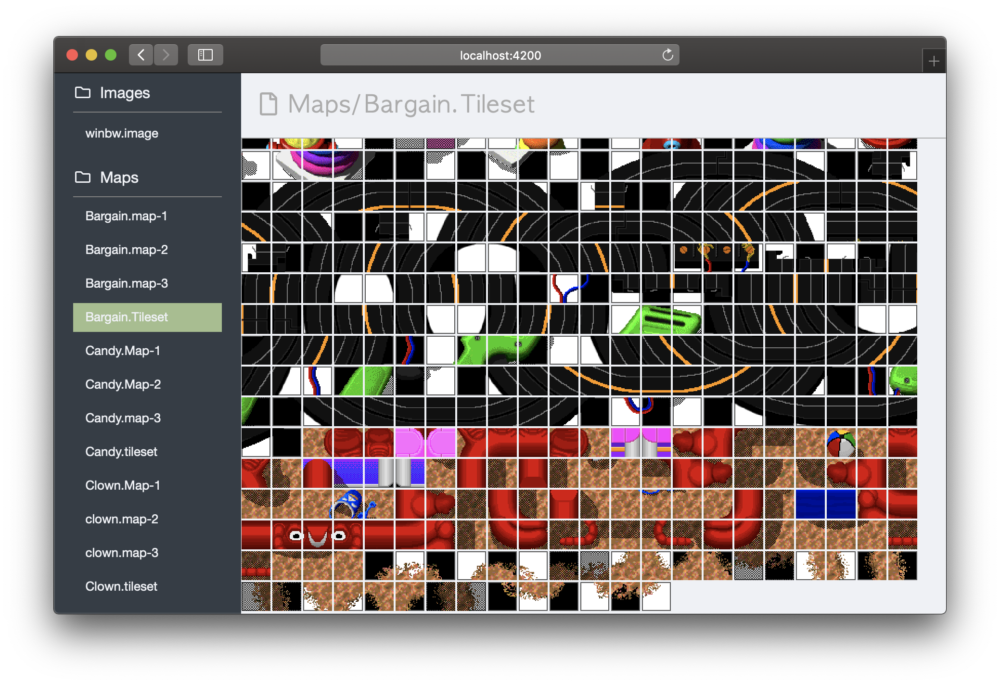

Mighty Resource Viewer
======================

A web app used to unpack and preview the game files used by *Power Pete* and *Mighty Mike*.

Instructions
------------

```sh
# Clone repository
$ git clone https://github.com/cyco/mighty-resource-parser.git

# Install dependencies
$ cd mighty-resource-parser
$ yarn install

# Start local server
$ yarn start

# Then, copy your game files into src/assets/Data/
# and navigate to http://localhost:4200/ in your browser
```

When you're done press `CTRL` and `c` together to stop the server.

To do list
----------

-	[ ] Convert compressed `snd` resources to a playable format
	-	See https://ffmpeg.org/doxygen/3.1/mace_8c_source.html for an implementation of the MACE 3:1 algorithm used to compress the music tracks and some sound effects
-	[ ] Show items in map viewer
-	[ ] Decode tile animations and add a way to preview them
-	[ ] Implement LZSS to unpack the spin animation

Screenshots
-----------










